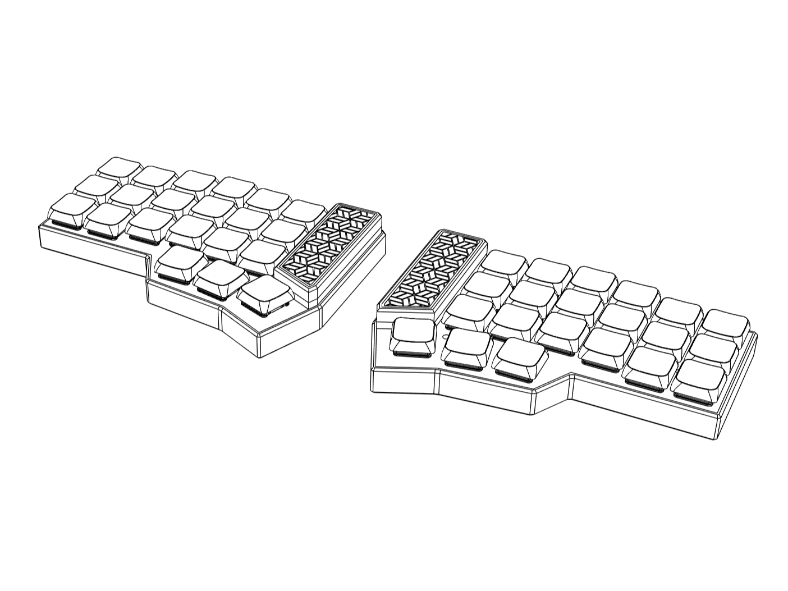

# 🎹 Baikal-Handwired-Split-Corne-Keyboard - Build Your Own Affordable Keyboard

  

An affordable, beginner-friendly handwired split keyboard build (~€20) using a Pro Micro NRF52840 (Nice!nano V2 clone). Wireless via ZMK (BLE) with USB wired mode fallback.

---

## 🎯 Why This Project?

The goal of this project is to create a simple, cheap, and easy-to-build handwired Corne keyboard with step-by-step instructions.

When I got into building keyboards, I wished something like this existed: a detailed guide that walks you through the entire process. This project is designed so anyone who wants to build their own handwired Corne can do it with confidence.

### 🔑 Key Features

- **Budget-friendly**: Total build cost around ~€20 (excluding keycaps and tools)
- **Beginner-friendly**: Ready-to-flash firmware included so no coding required if you follow the wiring diagram
- **Wireless**: Bluetooth Low Energy (BLE) via ZMK firmware
- **Flexible switch support**: Works with various switch types for customized feel and performance
- **Detailed guides**: Clear instructions to assist you from start to finish

## 🚀 Getting Started

To build your handwired split keyboard, follow these steps:

1. **Gather Required Materials**:
   - Pro Micro NRF52840 (Nice!nano V2 clone)
   - Switches of your choice
   - Diodes
   - Keycaps
   - Project box or case
   - Wires and soldering equipment
   - USB cable
   - Optional: PCB for easier assembly

2. **Follow the Wiring Diagram**:
   - Detailed wiring diagrams are provided in the repository to guide you. Each step includes visuals to help clarify the process.

3. **Download Firmware**:
   - You can download the firmware from the Releases page to get started. This firmware allows your keyboard to communicate wirelessly.

### 📥 Download & Install

Visit this page to download the latest version of the firmware: [Download Release](https://github.com/MohammadFarrah21/Baikal-Handwired-Split-Corne-Keyboard/releases).

1. Click the link above.
2. Find the latest release in the list.
3. Download the firmware file that matches your needs.

### ⚙️ Installation Steps

1. Connect your Pro Micro to your computer using a USB cable.
2. Flash the downloaded firmware onto your Pro Micro. Instructions for flashing are included in the documentation.
3. Assemble your keyboard following the wiring diagram.
4. Enjoy your new custom keyboard.

### 📋 System Requirements

- A computer with USB-C or USB-A port.
- Operating systems: Windows, macOS, or Linux.
- Soldering skills are recommended but not required.

### 🚧 Troubleshooting

If you encounter issues:

- Ensure all connections are secure.
- Double-check the wiring against the diagram.
- Consult the FAQ section in the repository for common problems and solutions.

## 📖 Additional Resources

- For further details, refer to the [Documentation](https://github.com/MohammadFarrah21/Baikal-Handwired-Split-Corne-Keyboard/docs).
- Join the community forums for support and tips from other builders.

With this guide, you are set to build your own handwired split keyboard confidently. Embrace the experience and enjoy your new creation!