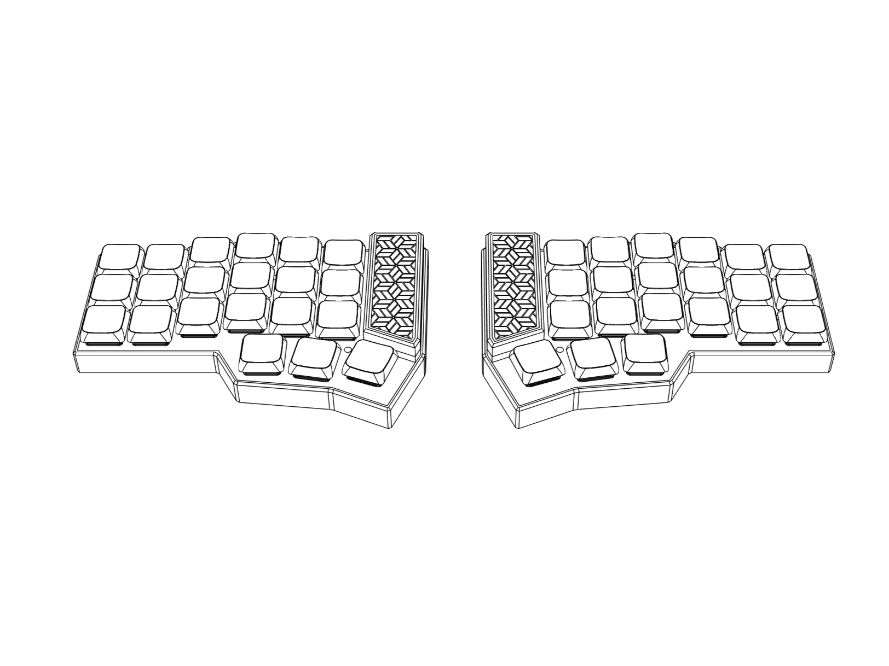
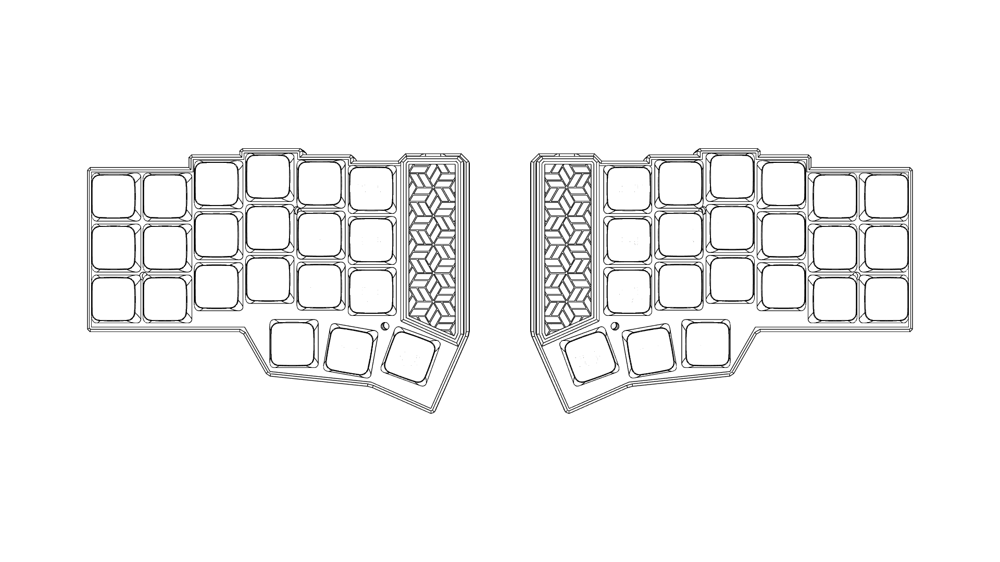

# Baikal Handwired Split Corne Keyboard

<p align="center">
  
</p>

An affordable, beginner-friendly handwired split keyboard build (~€20) using a Pro Micro NRF52840 (Nice!nano V2 clone). Wireless via ZMK (BLE) with USB wired mode fallback.

---

## Why This Project?

**The goal of this project is to create a simple, cheap, and easy-to-build handwired Corne keyboard with step-by-step instructions.**

When I got into building keyboards, I wished something like this existed — a detailed guide that walks you through the entire process without assuming prior knowledge. This project is designed so anyone who wants to build their own handwired Corne can do it with confidence.

### Key Features

- **Budget-friendly**: Total build cost around ~€20 (excluding keycaps and tools)
- **Beginner-friendly**: Ready-to-flash firmware included — no coding required if you follow the wiring diagram
- **Wireless**: Bluetooth Low Energy (BLE) via ZMK firmware
- **Flexible switch support**: Works with both **Kailh Choc low-profile** switches AND **standard MX** switches
- **ZMK Studio compatible**: Edit your keymap visually without reflashing
- **Customizable**: If you wire differently or want to tweak the firmware, the source repo is available

---

## Gallery

### Real Build

<p align="center">
  
</p>

### Renders

<p align="center">
  
</p>

<p align="center">
  
</p>

<p align="center">
  
</p>

---

## Keymap Layers

The firmware comes with 3 layers preconfigured:

### Base Layer (QWERTY)

<p align="center">
  
</p>

### Lower Layer (Numbers + Bluetooth)

<p align="center">
  
</p>

- Numbers 1-0 on top row
- Bluetooth profile selection (BT_SEL 0-4)
- Bluetooth clear (BT_CLR)
- Arrow keys on right side

### Raise Layer (Symbols)

<p align="center">
  
</p>

- Symbols: ! @ # $ % ^ & * ( )
- Brackets: [ ] { }
- Math operators: - + = * /
- Special: \ | ~ `

---

## Bill of Materials (BOM)

This is a handwired build — soldering tools/consumables (iron, solder, flux) are **not included** in the cost estimate.

### Approximate total: ~€20

| Component | Qty | Est. Price | Notes & Links |
|-----------|-----|------------|---------------|
| **Nice!nano V2 clone** (NRF52840 Pro Micro) | 2 | ~€12-16 | [AliExpress search](https://www.aliexpress.com/w/wholesale-nice-nano-v2.html) - Look for "NRF52840 Pro Micro" or "SuperMini NRF52840" |
| **Kailh Choc V1 switches** | 42 | ~€8-15 | [AliExpress search](https://www.aliexpress.com/w/wholesale-kailh-choc-v1-switch.html) - OR use MX switches |
| **MX switches** (alternative) | 42 | varies | Use whichever you prefer - case supports both! |
| **1N4148 diodes** | 42+ | ~€1-2 | [AliExpress search](https://www.aliexpress.com/w/wholesale-1n4148-diode.html) - Buy extra |
| **Magnet/enameled wire** | 1 roll | ~€2-3 | [AliExpress search](https://www.aliexpress.com/w/wholesale-enameled-copper-wire-0.5mm.html) - 0.3-0.5mm recommended |
| **LiPo battery** (301230 or similar) | 2 | ~€3-5 | [AliExpress search](https://www.aliexpress.com/w/wholesale-301230-lipo-battery.html) - 100-150mAh, fits under MCU cover |
| **M2 heat-set inserts** | 8-12 | ~€1-2 | [AliExpress search](https://www.aliexpress.com/w/wholesale-m2-heat-set-insert.html) - M2 x 3mm x 3.5mm |
| **M2 screws** | 8-12 | ~€1 | [AliExpress search](https://www.aliexpress.com/w/wholesale-m2-screw-4mm.html) - M2 x 4mm or M2 x 5mm |
| **Keycaps** | 42 | varies | 3D print or buy - [Choc keycaps](https://www.aliexpress.com/w/wholesale-kailh-choc-keycaps.html) / [MX keycaps](https://www.aliexpress.com/w/wholesale-mx-keycaps.html) |

### Notes on Parts

- **Switches**: The case design supports both Kailh Choc (low-profile) and MX-style switches. Choose based on your preference. Choc gives a slimmer profile, MX has more variety.
- **Keycaps**: Can be bought or 3D printed. Plenty of good quality keycaps online — depends on your budget and what you have available.
- **Batteries**: Optional if you only want wired mode. For wireless, 301230 size fits nicely under the MCU cover.
- **Wire**: Enameled/magnet wire works great for handwiring. You can also use stripped solid-core wire.

---

## Wiring Diagram

<p align="center">
  
</p>

The diagram shows GPIO pin numbers for both halves. **Follow this exactly if you want to use the prebuilt firmware.**

- **Green lines** = Rows
- **Red lines** = Columns
- Numbers correspond to NRF52840 GPIO pins

---

## Build Instructions

Full step-by-step instructions are included in the PDF:

📄 **[Baikal Build Instructions (PDF)](media/Baikal%20build%20instructions.pdf)**

Please read the build guide before starting. It includes:
- Wiring details and assembly sequence
- Tips for handwiring
- Notes specific to this design

---

## Firmware

### Ready-to-Flash Firmware

If you wire according to the provided diagram, you can flash the prebuilt firmware directly:

| Half | File |
|------|------|
| Left | [corne_hw_left-nice_nano_v2-zmk.uf2](Ready%20to%20flash%20Firmware/corne_hw_left-nice_nano_v2-zmk.uf2) |
| Right | [corne_hw_right-nice_nano_v2-zmk.uf2](Ready%20to%20flash%20Firmware/corne_hw_right-nice_nano_v2-zmk.uf2) |
| Reset (troubleshooting) | [settings_reset_nice_nano.uf2](Ready%20to%20flash%20Firmware/settings_reset_nice_nano.uf2) |

### Flashing Instructions (UF2)

1. Put the Nice!nano into bootloader mode (double-tap the reset button quickly)
2. A USB drive named `NICENANO` should appear
3. Drag-and-drop the appropriate `.uf2` file onto the drive
4. The board will automatically reboot with new firmware
5. Repeat for the other half

### Custom Firmware

If you wire differently or use a different controller, you'll need to build your own ZMK firmware:

- **My ZMK config repo**: [github.com/vostoklabs/zmk-config-hw](https://github.com/vostoklabs/zmk-config-hw) — Fork this and modify for your needs
- **ZMK User Setup Guide**: [zmk.dev/docs/user-setup](https://zmk.dev/docs/user-setup)
- **ZMK Documentation**: [zmk.dev/docs](https://zmk.dev/docs)

### ZMK Studio

This build supports [ZMK Studio](https://zmk.dev/docs/features/studio) for convenient keymap adjustments without reflashing. Connect via USB or Bluetooth and edit your layout visually.

---

## 3D Printed Case

The case is designed for FDM 3D printing and consists of:

1. **Bottom case** — Main housing
2. **Switch plate** — Holds the switches in place
3. **MCU cover** — Decorative cover for the controller area

### Print Settings (recommended)

| Setting | Value |
|---------|-------|
| Layer height | 0.2mm |
| Infill | 15-20% |
| Supports | Not needed |
| Material | PLA or PETG |

### Files

The `.3mf` file in this repo is ready to slice:

- `Baikal Split Keyboard.3mf` — Contains all parts, pre-oriented

**STEP files** for modification are in the `step files/` folder if you want to edit the design.

### Assembly

1. Install heat-set inserts into the bottom case (use soldering iron)
2. Insert switches into the plate
3. Complete the handwiring
4. Secure the plate to the case with M2 screws
5. Snap on the MCU cover

---

## Project Structure

```
├── README.md                           # This file
├── Baikal Split Keyboard.3mf          # 3D print file (ready to slice)
├── media/
│   ├── Baikal build instructions.pdf   # Detailed build guide
│   ├── wiring diagram.jpg              # GPIO pin mapping
│   ├── base layer.png                  # Keymap layer 0
│   ├── lower layer.png                 # Keymap layer 1
│   ├── raise layer.png                 # Keymap layer 2
│   ├── front.png                       # Render
│   ├── top.png                         # Render
│   ├── exploded view.png               # Render
│   ├── Home.png                        # Hero image
│   └── real pic.jpg                    # Actual build photo
├── Ready to flash Firmware/
│   ├── corne_hw_left-nice_nano_v2-zmk.uf2
│   ├── corne_hw_right-nice_nano_v2-zmk.uf2
│   └── settings_reset_nice_nano.uf2
└── step files/                         # CAD source files
    ├── Case step files.step
    ├── MCU cover step.step
    └── Plates step.step
```

---

## Contributing

Found an issue or have a suggestion? Feel free to open an issue or PR!

---

## License

This project is open source. Feel free to use, modify, and share.

---

## Credits

Designed by [Vostok Labs](https://github.com/vostoklabs)

Inspired by the [Corne keyboard](https://github.com/foostan/crkbd) by foostan.
